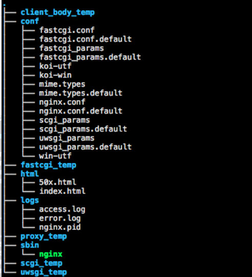
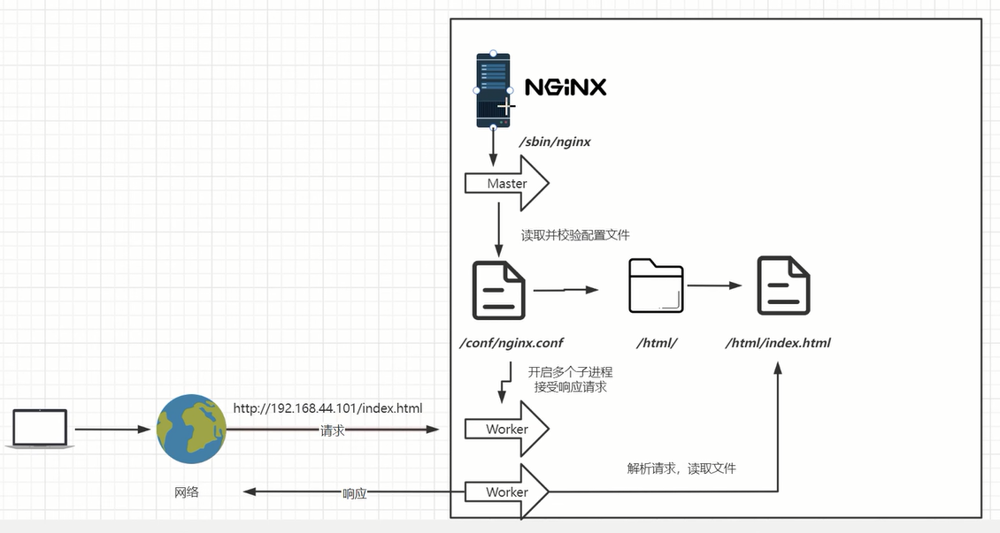
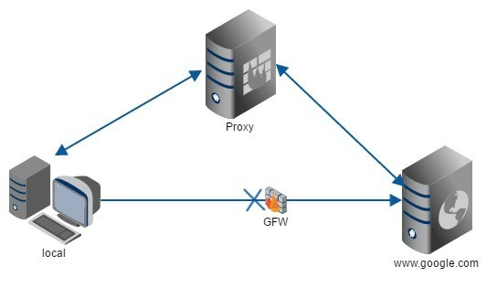
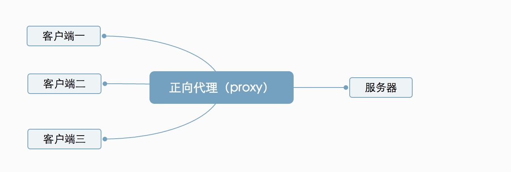
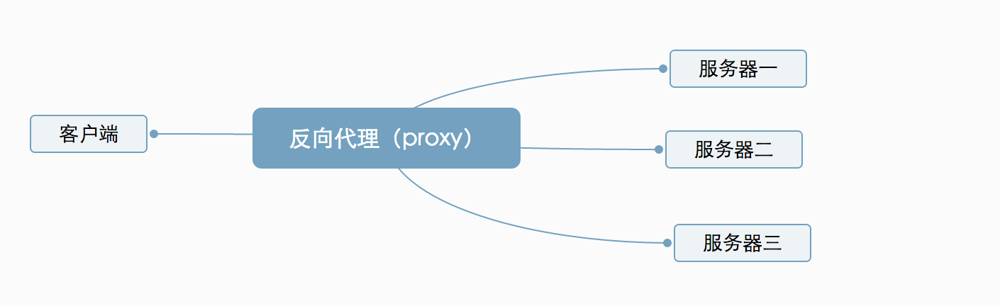
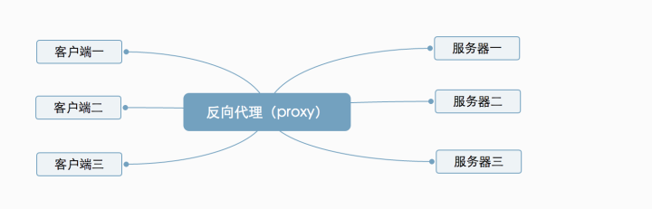
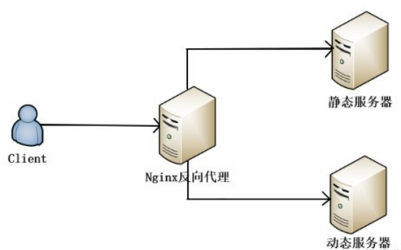
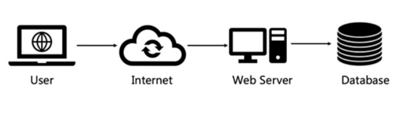
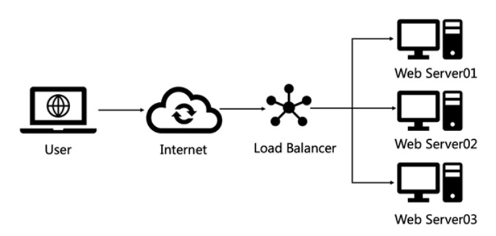

# 1、nginx是什么？

> ## nginx简介
>
> > ​	Nginx是一款轻量级的Web 服务器/反向代理服务器及电子邮件（IMAP/POP3）代理服务器，在BSD-like 协议下发行。其特点是占有内存少，并发能力强，事实上nginx的并发能力在同类型的网页服务器中表现较好。
> >
> > Nginx 是一个很强大的高性能Web和反向代理服务，它具有很多非常优越的特性。在连接高并发的情况下，Nginx是Apache服务不错的替代品：Nginx在美国是做虚拟主机生意的老板们经常选择的软件平台之一。能够支持高达 50,000 个并发连接数的响应，感谢Nginx为我们选择了 epoll and kqueue作为开发模型。
> >
> > *tip: ` epoll`是一种`io事件`通知机制（如： read、selct、poll）。*
>
> ## nginx的优点
>
> > + 更快
> >
> >   ​	体现在两方面：一方面，在正常情况下，单次请求会得到更快的响应；另一方面，在高峰期，Nginx可以比其他Web服务器更快的响应请求。
> >
> > +  高扩展性
> >   ​        Nginx完全是由多个不同功能、不同层次、不同类型且耦合程度极低的模块组成的，也造就了Nginx庞大的第三方模块。Nginx的模块都是嵌入到二进制文件中执行的，无论官方发布的模块还是第三方模块都是如此。
> >
> > + 高可靠性
> >   ​         Nginx的高可靠性来自于其核心框架代码的优秀设计、模块设计的简单性；另外，官方提供的常用模块都非常稳定，每个worker进程相对独立，master进程在1个worker进程出错时可以快速的“拉起”新的worker子进程提供服务。
> >
> > + 低内存消耗
> >
> >   ​	一般情况下，10000个非活跃的HTTP Keep-Alive连接在Nginx中仅消耗2.5MB内存，这是Nginx支持高并发连接的基础。
> >
> > + 单机支持
> >
> >   ​	10万以上的并发连接理论上，Nginx支持的并发连接上限取决于内存，10万远未封顶。
> >
> > + 热部署
> >
> >   ​	master管理进程与worker工作进程的分离设计，使得Nginx能够提供热部署功能，即可以在7*24小时不间断服务的情况下，升级Nginx的可执行文件。当然，也支持不停止服务就更新配置项、更换日志文件等功能。
> >
> > + 最自由的BSD许可协议
> >
> >   ​	BSD许可协议不只是允许用户免费使用Nginx，还允许用户在自己的项目中直接使用或修改Nginx源码，然后发布。
> >
> > +  ​
>
> 

# 2、nginx介绍

> ## Nginx的目录说明
>
> > 
> >
> >  
> >
> > - conf 配置文件目录（.default 文件为对应的默认文件）
> >
> >   - mime.types
> >
> >     ​	当 Web 服务器收到静态的资源文件请求时，依据请求文件的后缀名在服务器的 MIME 配置文件中找到对应的 MIME Type，再根据 MIME Type 设置 HTTP Response 的Content-Type，然后浏览器根据 Content-Type 的值处理文件
> >
> >   - nginx.conf     
> >
> >     ​	Nginx 的配置文件
> >
> > - html 默认解析的静态文件目录
> >
> > - logs 日志目录
> >
> >   - access.log 访问日志，包含所有访问记录
> >   - error.log 错误日志，包含访问出错的记录
> >   - nginx.pid Nginx 运行的进程号，同ps -ef | grep nginx 第一行的进程号
> >
> > - sbin Nginx 可执行文件目录
> >
> >   - nginx 
> >
> >     ​	Nginx程序的启动文件
> >
> > *tip:`koi-utf`、`koi-win`、`win-utf` 是与编码转换有关的配置文件，其它带 `temp` 的时nginx运行产生的临时目录* 
> >
> > 
>
> ## nginx运行流程图
>
> > 
> >
> > 
>
> ## nginx最小配置说明
>
> > ```shell
> > #全局块
> > ################################
> > worker_processes  1;   # worker进程的个数，建议和物理cpu数量保持一致
> > #nginx支持的最大并发数 = worker_processes * worker_connections / 2 (反向代理的动态资源是4)
> >
> > #事件块
> > ################################
> > events {
> >     worker_connections  1024;  # 一个worker的最大连接数量
> > }
> >
> > #网络请求块
> > ################################
> > http {
> >     include       mime.types;    # 导入文件类型，http头字段content-type的值
> >     default_type  application/octet-stream;  # 默认的类型
> >     keepalive_timeout  65;  # 长连接的保持时间
> >     sendfile        on;   #开启高效文件传输模式，sendfile指令指定nginx是否调用sendfile函数来输出文件，对于普通应用设为 on，如果用来进行下载等应用磁盘IO重负载应用，可设置为off，以平衡磁盘与网络I/O处理速度，降低系统的负载。注意：如果图片显示不正常把这个改成off。
> >
> >
> >  	#虚拟主机块：一个server只能代理一个端口
> >  	################################
> >     server {
> >         listen       80;   # 监听的端口号
> >         server_name  localhost;
> > 		
> > 		#location块：处理具体的请求
> > 		#########################
> >         location / {
> >             root   html;
> >             index  index.html index.htm;
> >         }
> >
> >         error_page   500 502 503 504  /50x.html;
> >         location = /50x.html {
> >             root   html;
> >         }
> >     }
> > }
> > ```
> >
> > ### location的匹配规则，优先级按照从高到底排序:
> >
> > > - `location = /xxx`: 路径精确匹配
> > > - `location ^~ /xxx`: 路径前缀匹配
> > > - `location ~ xxx`: 路径正则匹配
> > > - `location ~* xxx`: 路径正则匹配, 不区分大小写, 与正则匹配的优先级相同
> > > - `location !~ xxx`: 正则不匹配（区分大小写）, 与正则匹配的优先级相同
> > > - `location !~* xxx`: 正则不匹配（不区分大小写）, 与正则匹配的优先级相同
> > > - `location /xxx` : 路径前缀匹配,会继续向下匹配，最终找到最长的那个
> > > - `location /` : 通用匹配, 当其他都没有匹配的时候, 会走到这里
> > >
> > > *tip：精准匹配、匹配到就会结束匹配,不会继续向下匹配了*
> >
> >  
>
> 

# 3、nginx的使用

> + 正向代理：代理用户
> + 反向代理：代理服务器
> + 静态分离：将静态资源和动态资源进行分离(基于反向代理)
> + 负载均衡：分配客户端请求到不同的服务器(基于反向代理)
>
> ## 1、什么是代理
>
> > ​	代理本质上是**一台中转的服务器。**可以类比为一个中介，A 和 B 本来可以直连，中间插入一个 C，C 就是中介。拿买房举个例子，买家和卖家原本可以直接交流，但如果卖家把卖房事宜委托给中介后，买家都只能先通过中介来联系卖家，再由中介转述回买家。
> >
> > 
> >
> > 
>
> ## 2、`正向代理`：代理客户端
>
> >  ​	正向代理常见于提供vpn（”翻墙“）服务的软件。如：有VPN、5VPN、Snap VPN、极速安全VPN、蝙蝠VPN、绿豆VPN、VPN333、快喵等。
> >  ​	它的特点有：隐藏了真实的请求客户端，服务端不知道真实的客户端是谁，客户端请求的服务都由代理服务器代替来请求。
> >
> >  ​	***tip:  "翻墙“违法，请理智使用***
> >
> >  ​	
> >
> >  ​	举例来说，当国内用户直接访问 Google的网站时，由于网络的问题，访问请求会被阻挡掉。这个时候可以先把访问请求发送到一个代理服务器（可以访问 Google 的服务器）上，然后由其代为转发请求和接收响应内容。
> >
> >  
> >
> >    
> >
> >  ​	
> >
> >  ​	当出现多个用户请求Google时，就成这样了：
> >
> >  
> >
> >  
> >
> >  ​	简单来说：**正向代理** 是代理的客户端，服务端不知道请求具体来自那个服务端。
>
> ## 3、`反向代理`：代理服务端
>
> >  ​	反向代理代理的是服务端，隐藏了真实的服务端，恰好跟正向代理相反。
> >
> >  
> >
> >  
> >
> >  ​	举例来说：当我们请求百度的时候，百度的服务器可能有成千上万台，但具体请求的是哪一台，我们不知道，我们只需要知道百度的反向代理服务器是`http://www.baidu.com` 就可以了，它会帮我们把请求转发到一台真实的服务器去。
> >
> >  
> >
> >  
> >
> >  ​	当很多用户同时访问同一个网站时，就成这样了：
> >
> >  
> >
> >  
> >
> >  ​	正向代理和反向代理都是代理。只不过两者代理的对象不一样的。正向代理代理的对象是客户端，反向代理代理的是服务端。
> >
> >  **`反向代理的配置`**
> >
> >  ```shell
> >  location / {
> >  	#将请求代理到http://127.0.0.1:3001
> >      proxy_pass   http://localhost:3001;       
> >  }
> >  ```
> >
> >  
>
> ## 4、`静态分离`：将静态资源和动态资源放到不同的服务器中(基于反向代理) 
>
> >  ​	动静分离是指在web服务器架构中，将静态页面与动态页面或者静态内容接口和动态内容接口分开不同系统访问的架构设计方法，进而提升整个服务访问性能和可维护性。简单来说就是用nginx把静态请求（如：html、css、js、图片）和动态请求（如：java接口）反向代理到不同的服务器中。
> >
> >  
> >
> >  **`静态分离`** 一般可以使用url路径或者二级域名进行反向代理
> >
> >  tips: 当网站流量过大时，可以考虑使用`cdn(内容分发)技术`做动静分离。*
> >
> >  
>
> ##  5、`负载均衡`：分配客户端请求到不同的服务器(基于反向代理)
>
> >  ​	在网站流量比较小的时候，一般使用单台服务器就能满足对外提供服务的需求。随着业务流量地不断增大，单台服务器无论如何优化、采用多好的硬件，总会有性能天花板，当单服务器的性能无法满足业务需求时，就需要把多台服务器组成集群系统提高整体的处理性能。
> >
> >  ​	为解决上述问题，可以使用一个统一的流量调度器，通过均衡的算法，将用户大量的请求流量均衡地分发到集群中不同的服务器上。这就叫做**负载均衡**。
> >
> >  使用负载均衡可以带来的几个好处：
> >
> >  - 提高了系统的整体性能
> >
> >  - 提高了系统的扩展性
> >
> >  - 提高了系统的可用性
> >
> >    ​
> >
> >    **不使用负载均衡的web网站架构示意图**
> >
> >    
> >
> >    ​	客户端之间通过网络与Web服务端相连，如果Web服务器宕机，那么用户访问网站时将得不到任何响应。即使服务器可以正常工作，如果很多用户同时访问服务器，超过服务器的处理能力，那么会出现响应速度慢或者无法连接的情况。
> >
> >    ​
> >
> >    **使用负载均衡的web网站架构示意图**
> >
> >    
> >
> >    ​	负载均衡器会维护一个可用的服务清单，通过心跳检测等方式来剔除故障的服务端节点以保证服务器清单中都是可以正常访问的服务器。当客户端借助网络发送请求到负载均衡器时，负载均衡器会按照某种算法，从维护的服务清单里面选择一个服务器，并将客户端请求转发到指定的服务器，从而提高系统的可用性和稳定性。
> >
> >    ​
> >
> >    ### 常见的复杂均衡策略
> >
> >    > + `round robin`：轮询模式，默认模式就是轮询模式。
> >    >
> >    >   ```shell
> >    >   upstream server_group {
> >    >      server backend1.example.com;
> >    >      server backend2.example.com down;
> >    >      server backend3.example.com backup;
> >    >   } 
> >    >   ```
> >    >
> >    >   + `down`: 表示当前server暂时暂时不参与轮询
> >    >   + `backup`:表示当前server是备用服务,其他服务都down或者挂掉后才启动服务
> >    >
> >    > + `random`：随机模式
> >    >
> >    > ```shell
> >    > upstream server_group {
> >    >    random;
> >    >    server backend1.example.com;
> >    >    server backend2.example.com;
> >    > }
> >    > ```
> >    >
> >    > + `weight`：权重模式(最常用，但会导致状态不共享的问题)
> >    >
> >    > ```shell
> >    > upstream server_group {
> >    >     server backend1.example.com weight=5;
> >    >     #默认为不配置权重为1
> >    >     server backend2.example.com;
> >    > }
> >    > ```
> >    >
> >    > + `fair`：响应时长模式（ 需要在Nginx编译时加入nginx-upstream-fair模块）
> >    >
> >    > ```shell
> >    > upstream server_group{
> >    >    fair;
> >    >    server backend1.example.com;
> >    >    server backend2.example.com;
> >    > }
> >    > ```
> >    >
> >    > + `least_conn`：最少连接数
> >    >
> >    > ```shell
> >    > upstream server_group {
> >    >     least_conn;
> >    >     server backend1.example.com;
> >    >     server backend2.example.com;
> >    > }
> >    > ```
> >    >
> >    > + `ip_hash`：分配给这个ip上次访问时分配的服务器
> >    >
> >    > ```shell
> >    > upstream server_group {
> >    >     ip_hash;
> >    >     server backend1.example.com;
> >    >     server backend2.example.com;
> >    > }
> >    > ```
> >    >
> >    > + `url_hash`：根据上次访问的url分配
> >    >
> >    > ```shell
> >    > upstream server_group{
> >    >    hash $request_uri consistent;
> >    >    server backend1.example.com;
> >    >    server backend2.example.com;
> >    > }
> >    > ```
> >
> >
>
>  

# 4、趣味应用

> + **nginx实现一个简单的图片防盗链**
>
>   `使用http响应头的referer字段` 
>
>    ```shell
>   valid_referers none | blocked | server_names | strings | regexp;
>    ```
>
>   + none: 检测referer不存在的情况
>   + blocked: 检测referer头域的值被防火墙或代理服务器删除或伪装的情况。这种情况该请求头域的值不以http://或https://开头。
>   + server_names: 设置一个或多个URL，检测Referer头域的值是否在其中。
>   + strings|regexp： 任意字符串或者正则表达式。
>
>   ​
>
>   **在需要的location中配置**
>
> ```shell
> valid_referers 127.0.0.1;
> if ($invalid_referer) {
> 	return 403;
> }
> ```
>
> + **nginx实现一个图片反盗链**
>
>   `在反向代理时重写http的referer字段`
>
> ```shell
> location ^~ /img {
>    proxy_pass http://cdn.nlark.com;
>    proxy_set_header referer "";
>  }
> ```
>
>  

# 5、其他

> + [nginx官网](http://nginx.org/ "nginx官网")
> + [nginx中文文档 ](https://www.nginx.cn/doc/ "nginx中文文档")
> + [Tengine](http://tengine.taobao.org/ "tengine")：淘宝开源的nginx框架

